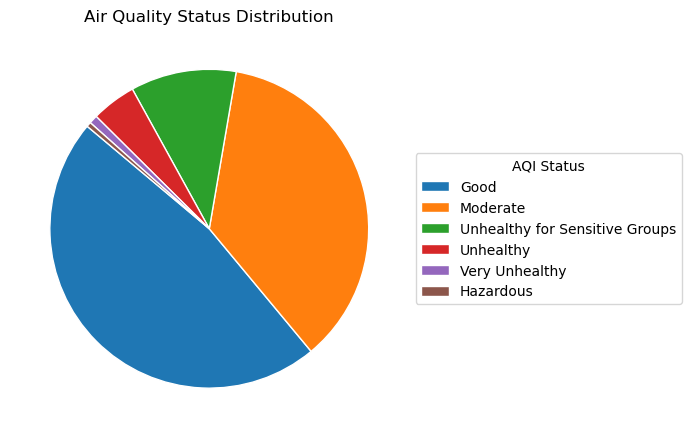
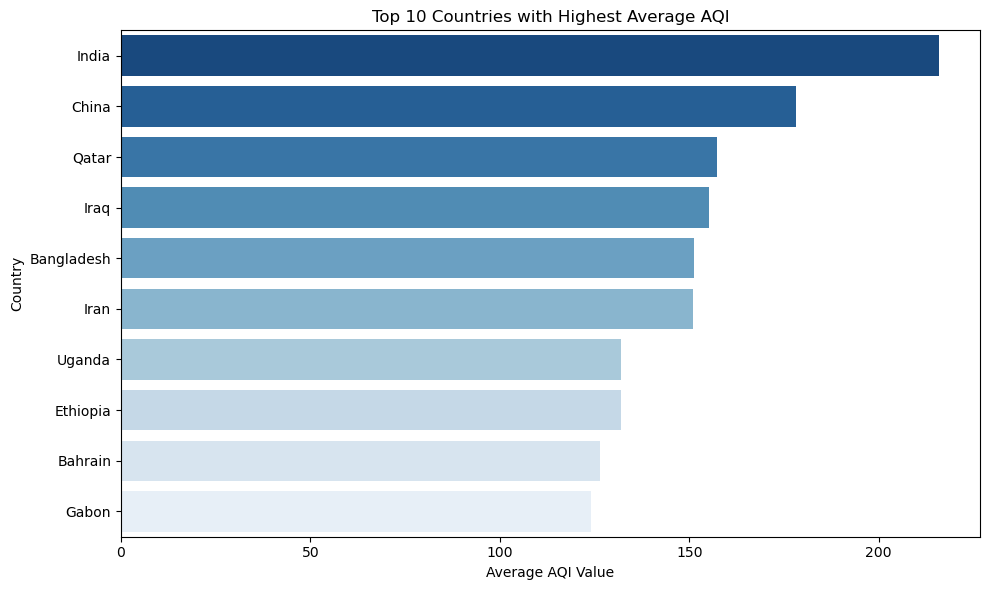
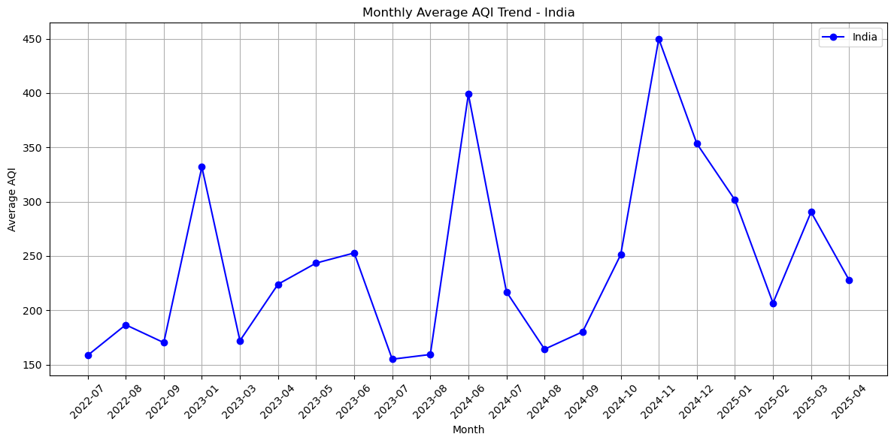
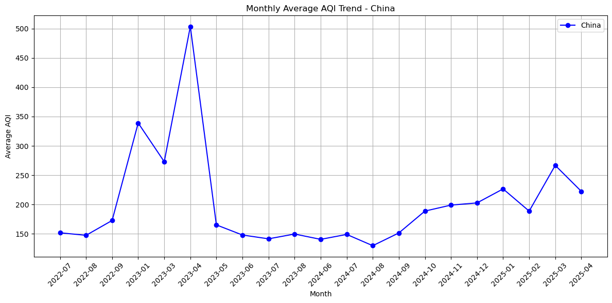
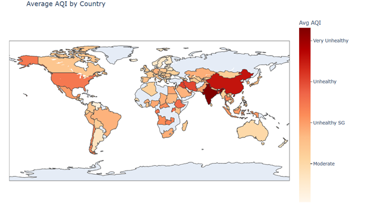
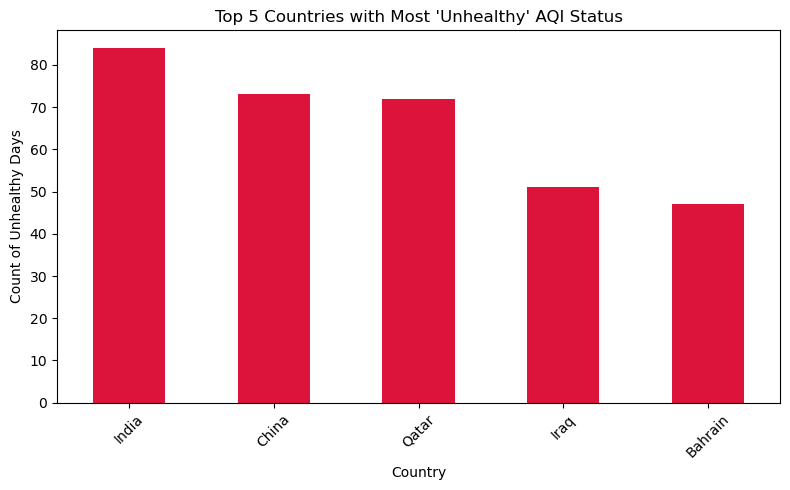
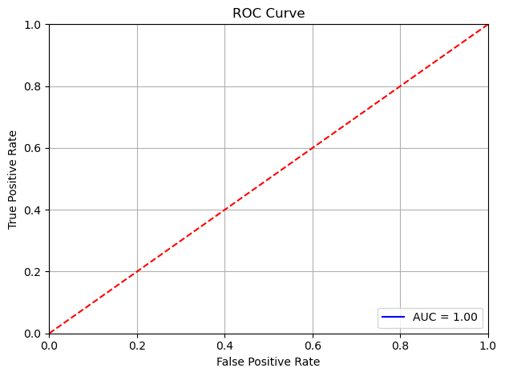

# Global AQI Analysis & Prediction – 2023

This project presents a comprehensive analysis of worldwide air quality data using visualizations and machine learning. The goal is to uncover pollution trends across regions and time, highlight contributing factors (e.g., seasonal events), and predict AQI status using a logistic regression model.

---

## Dataset

- **File**: `data_date.csv`
- **Columns**:
  - `Date`: Date of the AQI reading
  - `Country`: Country of the measurement
  - `Status`: Air quality status (e.g., Good, Moderate, Unhealthy, Unhealthy for Sensitive Groups, Very Unhealthy, and Hazardous)
  - `AQI Value`: Numeric AQI index value

---

## Technologies Used

- Python (Jupyter Notebook)
- Pandas, NumPy
- Matplotlib, Seaborn, Plotly Express
- Scikit-learn (Logistic Regression)
- PyCountry (for mapping country codes)

---

## Visualizations & Analysis

### 1. Air Quality Status Distribution
A pie chart illustrating the distribution of various AQI categories across all recorded countries. This visualization helps identify the most commonly experienced air quality levels, giving a general sense of how polluted the global atmosphere is over the dataset period.

---

### 2. Top 10 Countries with Highest Average AQI
This bar chart highlights the countries with the highest average AQI values, indicating which regions consistently experienced the worst air quality throughout the year. It's a useful snapshot to identify pollution hotspots on a country level.

---

### 3. Monthly AQI Trend – India
A line graph depicting the monthly average AQI values in India. Noticeable spikes during October and November align with Diwali celebrations, when widespread use of fireworks and other festivities contribute to elevated pollution levels.

---

### 4. Monthly AQI Trend – China
This line graph shows AQI trends in China over time. The sharp peak around March–April 2023 is attributed to a major sandstorm event, reflecting how natural environmental events can drastically impact air quality.

---

### 5. AQI Trends – India, Pakistan, China
A comparative line chart tracking monthly AQI levels across three neighboring countries. The graph shows consistent AQI increases during the winter months (Nov–Jan), a result of winter smog formed by trapped pollutants due to temperature inversions.

---

### 6. AQI Choropleth World Map
An interactive choropleth map representing average AQI levels by country. Darker red shades indicate more severe pollution, while lighter shades denote cleaner air. This map helps visualize global patterns and regional differences in air quality.

---

### 7. Top 5 Countries with Most 'Unhealthy' Status Days
A bar graph showing which countries experienced the highest number of 'Unhealthy' air quality days. This visualization highlights regions facing chronic air quality challenges that may warrant environmental policy attention.

---

## Machine Learning: AQI Status Prediction

### Model:
- Logistic Regression

### Features Used:
- AQI Value
- Day
- Month
- Year

### Output:
- Predicted AQI Status (e.g., Good, Moderate, Unhealthy)

### Accuracy:
- 99.94% on the test set

### ROC Curve:
A Receiver Operating Characteristic (ROC) curve is plotted to evaluate the model’s ability to distinguish the “Good” AQI class from others. The area under the curve (AUC) helps assess model quality.

---

### Sample Prediction

Input: {'AQI Value': 65, 'Day': 21, 'Month': 7, 'Year': 2022}
Output: 'Moderate'

## Repository Contents

| File                          | Description                                  |
|-------------------------------|----------------------------------------------|
| `AQI_Analysis.ipynb`           | Main Jupyter notebook with all analysis      |
| `data_date.csv`                | AQI dataset with global air quality readings |
| `requirements.txt`             | List of dependencies for the environment     |
| `README.md`                    | Project documentation (this file)            |

## Author

**Sanjana Marri**  
 GitHub: [@sanjanamarri2521](https://github.com/sanjanamarri2521)

##  License

This project is open-source under the [MIT License](LICENSE).
